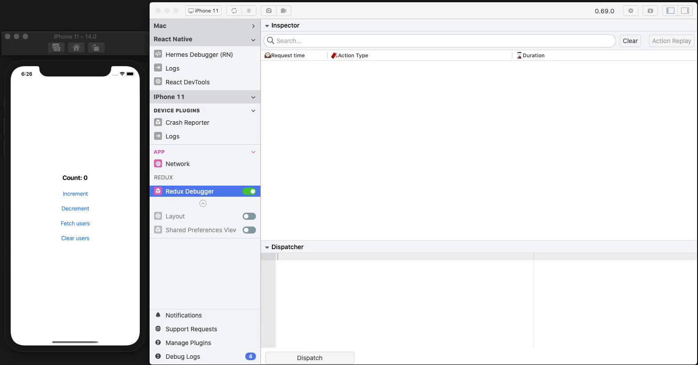

# flipper-plugin-react-native-redux-debugger
Flipper desktop plugin for react native redux logs via [Client Plugin](https://www.npmjs.com/package/redux-middleware-flipper)

> ❗For Flipper setup in your react native project, please refer to the [setup guide.](https://fbflipper.com/docs/getting-started/react-native)



## Features ✨
- Show all dispatched redux actions
- Show details about the action dispatched (action, state diff and the current state)
- Custom action dispatcher
- Replay selected actions
- Search for a specific action type

## Setup guide ✍🏻
- Install the `redux-middleware-flipper` and `react-native-flipper`.

```bash
yarn add redux-middleware-flipper react-native-flipper

# for iOS
cd ios && pod install
```

- Add the middleware in dev mode in your redux store setup file.

```javascript
if (__DEV__) {
  const reduxDebugger = require('redux-middleware-flipper').default;
  middleware.push(reduxDebugger());
}
```

- Open Flipper desktop app and install the plugin.

```
Manage Plugins > Install Plugins > search "RNReduxDebugger" > Install
```

## Options
```javascript
if (__DEV__) {
  const actionsBlacklist = ['SET_USER_ACCESS_TOKEN'];
  const actionsWhitelist = ['GET_USER_PROFILE_SUCCESS'];
  const actionReplayDelay = 500;

  const reduxDebugger = require('redux-middleware-flipper').default;
  middleware.push(reduxDebugger({ actionsBlacklist, actionsWhitelist, actionReplayDelay }));
}
```

- `actionsBlacklist` - Will not send these action types to Flipper

- `actionsWhitelist` - Will only send these action types to Flipper

- `actionReplayDelay` - Delay between multiple actions dispatched via Flipper plugin action replay. Default is *500 ms*.

## References 📚
- Getting started with [Flipper](https://fbflipper.com/docs/tutorial/intro)

## Motivation
- This project is inspired by [Flutter version](https://github.com/leanflutter/flipper-plugin-reduxinspector)

## ISC License (ISC)
Copyright 2020 Aseem Chaudhary

Permission to use, copy, modify, and/or distribute this software for any purpose with or without fee is hereby granted, provided that the above copyright notice and this permission notice appear in all copies.

THE SOFTWARE IS PROVIDED "AS IS" AND THE AUTHOR DISCLAIMS ALL WARRANTIES WITH REGARD TO THIS SOFTWARE INCLUDING ALL IMPLIED WARRANTIES OF MERCHANTABILITY AND FITNESS. IN NO EVENT SHALL THE AUTHOR BE LIABLE FOR ANY SPECIAL, DIRECT, INDIRECT, OR CONSEQUENTIAL DAMAGES OR ANY DAMAGES WHATSOEVER RESULTING FROM LOSS OF USE, DATA OR PROFITS, WHETHER IN AN ACTION OF CONTRACT, NEGLIGENCE OR OTHER TORTIOUS ACTION, ARISING OUT OF OR IN CONNECTION WITH THE USE OR PERFORMANCE OF THIS SOFTWARE.
